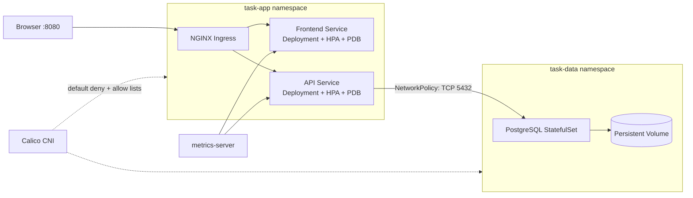

# Local Kubernetes Three-Tier Platform

[](https://github.com/German4341374/kind-three-tier-platform/actions/workflows/ci.yml)

A complete local Kubernetes portfolio project built with kind. It deploys a small task manager with a static frontend, FastAPI service, PostgreSQL, NGINX Ingress, enforced network policies, persistent storage, autoscaling, and development/production-style Kustomize overlays. It requires no cloud account or paid service.

## Architecture



## Technology stack

- kind 0.32.0 with Kubernetes 1.36.1 nodes pinned by digest
- kubectl 1.36.2 and Kustomize 5.8.1
- Calico 3.32.1, ingress-nginx 1.15.1, metrics-server 0.8.1
- FastAPI 0.115.8, Python 3.13, PostgreSQL 17.4, unprivileged NGINX 1.27.5
- kubeconform 0.8.0, kube-linter 0.8.3, yamllint 1.38.0, Trivy 0.72.0
- GitHub Actions with static and real kind smoke-test jobs

## Prerequisites

Use Linux or Windows with WSL2. Install Docker Engine or Docker Desktop with WSL integration, Bash, curl, tar, Python 3.13, pip, and Make. Recommended minimum: 4 CPU cores, 8 GB available RAM, and 15 GB free disk.

The setup script downloads pinned Linux binaries into `.tools/`; it does not need root access.

## Installation and usage

```bash
git clone https://github.com/German4341374/kind-three-tier-platform.git
cd kind-three-tier-platform
make setup
export PATH="$PWD/.tools/bin:$PATH"
make lint
make test
make up
make smoke
```

Open `http://task.localhost:8080`. If the hostname is not resolved by your environment, use `http://127.0.0.1:8080` with the `Host: task.localhost` header for CLI requests.

Delete everything when finished:

```bash
make down
make clean
```

Cluster deletion removes the local PostgreSQL volume and all demonstration data.

## Kustomize environments

The base contains shared security and workload configuration. Development lowers HPA/PDB availability settings and uses `:dev` local images. Production-style uses three replicas, larger API resources, stricter PDBs, and versioned `:1.0.0` images.

```bash
kustomize build kubernetes/overlays/development
kustomize build kubernetes/overlays/production
```

The production-style overlay demonstrates configuration shape; it is not a claim that kind is production infrastructure.

## Verification commands

```bash
kubectl get nodes
kubectl get pods,svc,ingress,hpa,pdb -n task-app
kubectl get pods,svc,pvc -n task-data
kubectl get networkpolicy -A
kubectl top pods -n task-app
curl -H 'Host: task.localhost' http://127.0.0.1:8080/api/tasks
make smoke
make rollback
```

`make rollback` deliberately starts an invalid frontend rollout, confirms it cannot progress, runs `kubectl rollout undo`, and verifies recovery. The old healthy replica remains available because the rolling strategy uses `maxUnavailable: 0`.

## Validation and CI

`make lint` builds both overlays and runs YAML linting, strict kubeconform schema validation, kube-linter, and Trivy configuration scanning. `make test` runs the API unit test. GitHub Actions repeats these checks and then creates a real three-node kind cluster, builds and loads both local images, installs pinned addons, runs smoke tests, demonstrates rollback, captures diagnostics, and deletes the cluster.

The workflow has read-only repository permissions, concurrency cancellation, no secrets, no registry publication, and no cloud credentials.

## Troubleshooting

- Docker unavailable: start Docker Desktop and enable WSL2 integration, then verify `docker info`.
- Nodes remain NotReady: inspect Calico pods with `kubectl get pods -n kube-system` and node events.
- Ingress returns 404: include `Host: task.localhost` and inspect the ingress-nginx controller.
- HPA shows unknown metrics: wait for metrics-server and run `kubectl top pods`; inspect its logs if it remains unavailable.
- API init container fails: check PostgreSQL readiness, Secret references, DNS, and both namespace NetworkPolicies.
- Port 8080 is occupied: stop the conflicting local process or change the host port in `kind/cluster.yaml` and `BASE_URL`.

The detailed incident procedure is in `docs/runbooks/troubleshooting.md`.

## Security considerations

- Restricted Pod Security labels on application and data namespaces.
- Non-root workloads, dropped Linux capabilities, RuntimeDefault seccomp, no service-account token mounting, and read-only application filesystems.
- Default-deny ingress/egress with explicit DNS, Ingress-to-workload, and API-to-PostgreSQL allowances.
- Resource requests/limits, probes, pinned images, separated namespaces, static scanning, and least-privilege ServiceAccounts.
- Committed Kubernetes Secrets contain only `local-demo-only` placeholders. Base64 encoding is not encryption; use External Secrets, SOPS, or a platform secret manager outside this demo.

## Limitations

- kind is disposable development infrastructure, not a production control plane.
- PostgreSQL has one replica and no backup automation; cluster deletion destroys its local data.
- Ingress uses HTTP only. Local TLS and certificate automation are future improvements.
- HPA behavior is demonstrable but not a load-test benchmark.
- Addon installation initially needs internet access to download manifests and images.
- The production-style overlay still uses local placeholder Secrets and must not be deployed unchanged.

## Future improvements

Add local TLS, sealed or external secrets, PostgreSQL backups, API migrations with Alembic, OpenTelemetry, Prometheus/Grafana, policy-as-code admission, multi-architecture image builds, image signatures, Gateway API, and a chaos-testing scenario.

## Interview talking points

- Why readiness depends on PostgreSQL while liveness does not.
- Deployment rollout guarantees versus PDB guarantees.
- Requests as both scheduler inputs and HPA utilization denominators.
- Namespace separation and Calico default-deny traffic flow.
- StatefulSet/PVC lifecycle and why one local database is not highly available.
- Base/overlay reuse and the difference between production-style configuration and production infrastructure.

See `DEMO.md`, `INTERVIEW.md`, `docs/explanations/kubernetes-concepts.md`, ADRs, and runbooks.

## License

MIT. See `LICENSE`.
